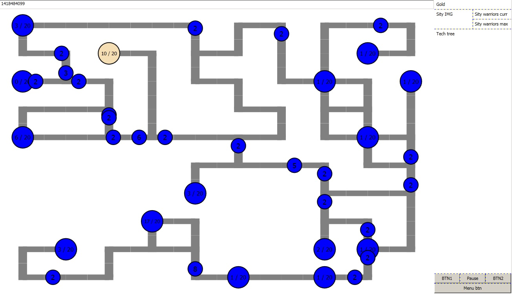
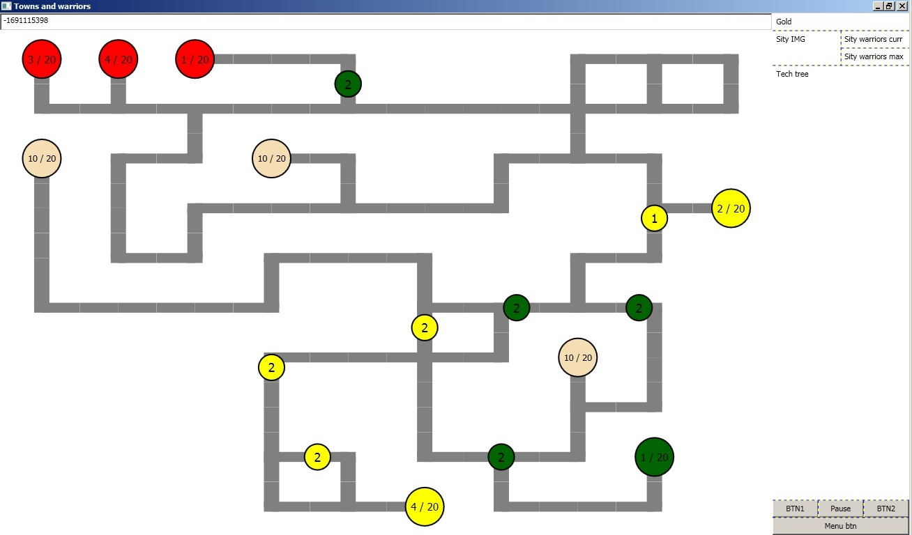
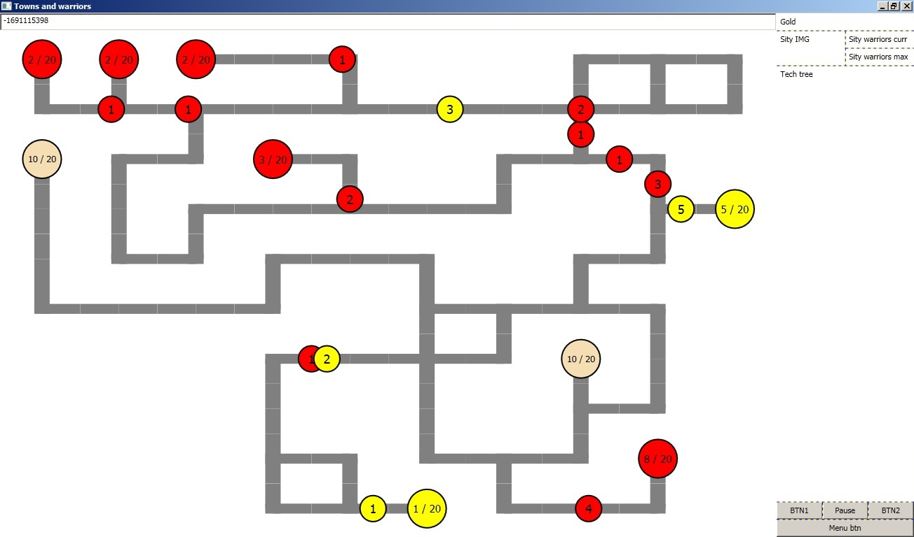

# TownsNWarriors

Casual strategy game like evocraf. STEP WPF course work

Master:  

Dev: 

## Controls:
 * Credits - start game)
 * In-game controls:
 	* LMB on your city - select city
 	* RMB on any city - send troops
 	* CTRL+A - select all your cities
	* CTRL+A(second time) - unselect all your cities
	* CTRL+[0..9] - create city group
 	* SHIFT+[0..9] - add to group
 	* [0..9] - choose group

## Features:
 * Random map generator
 * Sneaky bot
 * Game doesnt glue to I/O
 * Eazy to write and replace parts like: bot, map generator, city placer, players placer. Becouse game have module system.
	
## Team:
 * [Gigi220](https://github.com/Gigi220) 
 * [Shafranskyi](https://github.com/Shafranskyi) 
	
## Made with:
 * С#
 * WPF

## SCREENSHOTS

