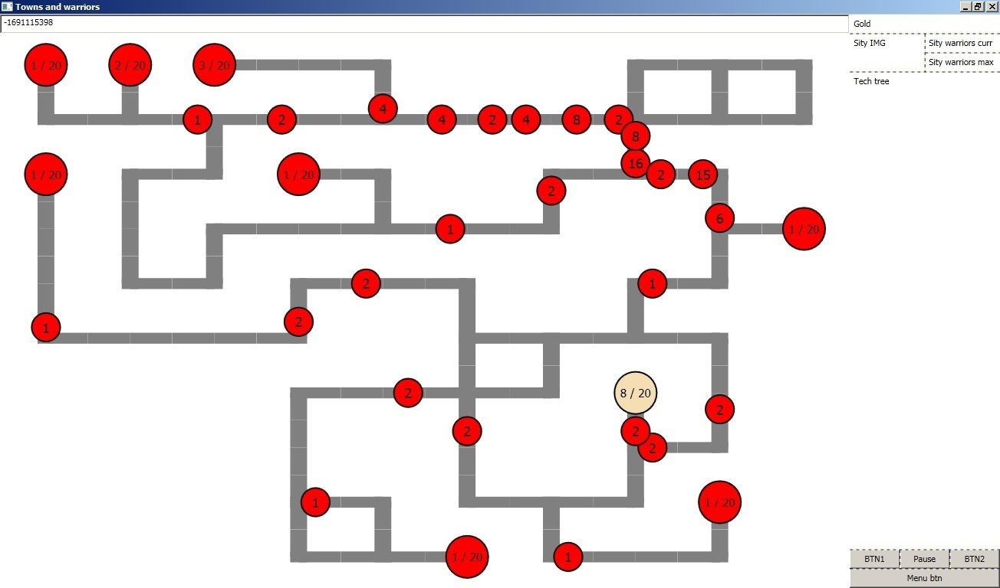

# TownsNWarriors

Казуальна стратегічна гра подібна до evocraft.
  
Master:   Dev: 

## Керування:
 * Credits - почати гру)
 * ЛКМ по свому місту - вибір міста
 * ПКМ по місту - послати туди юнитів
 * CTRL+A - вибір всіх твоїх міст
 * CTRL+A(2 раз) - НЕвибір всіх твоїх міст
 * CTRL+[0..9] - створити групу міст
 * SHIFT+[0..9] - додати до групи
 * [0..9] - вибір групи

## Фичи:
 * Випадкова генерація карти
 * Хитрий бот
 * Гра вийшла не привязаною до вводу/виводу.
 * Можна легко дописуваті і замінювати своїми такі частини: бота, генератор карти, розтановщик місць, розтановщик гравців
	
## Зроблено в команді з:
 * [Gigi220](https://github.com/Gigi220) 
  * Ідея
  * Ввід та вивід на ранніх стадіях
  * Правив баги 
 * [Shafranskyi](https://github.com/Shafranskyi) 
  * Вікна
  * Стилі
	
## Зроблено на
 * С#
 * WPF

